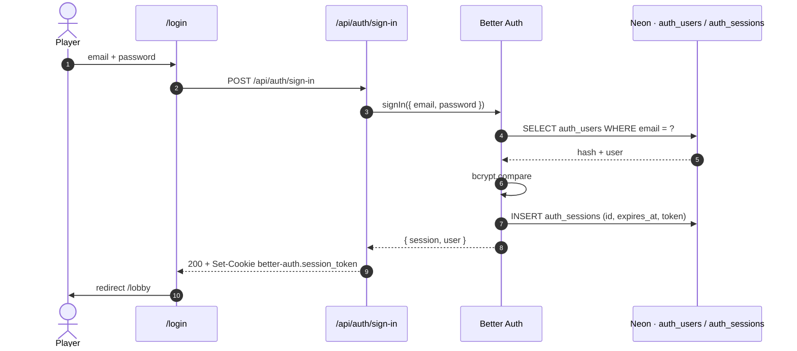
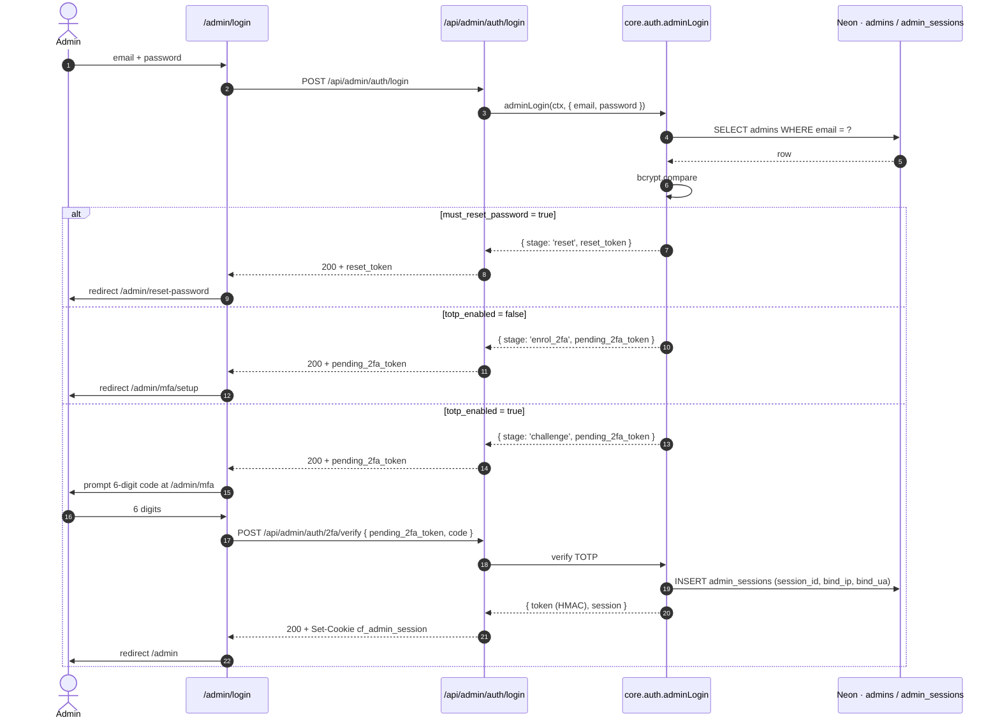
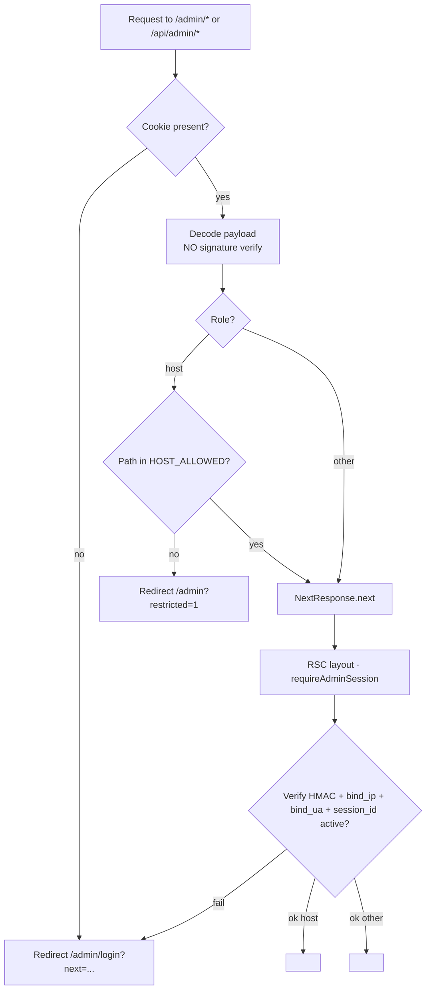
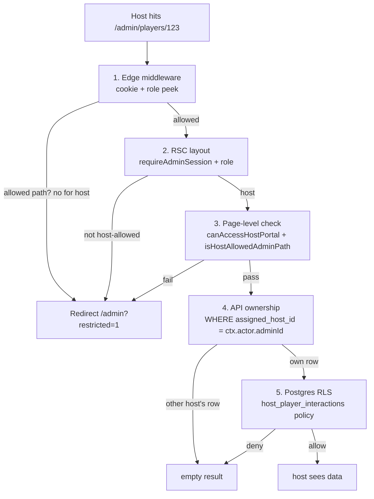
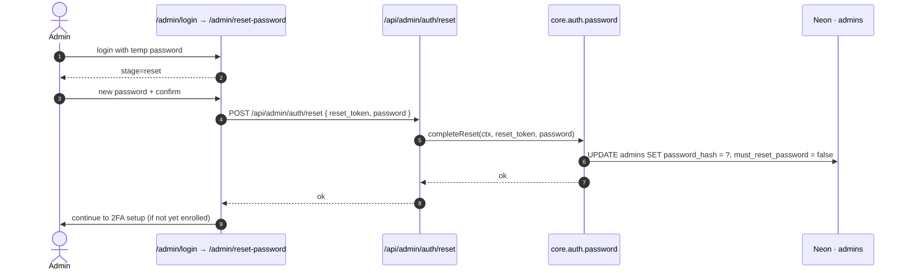

# Auth Flow

Sequence diagrams for the four flows you'll be debugging most often.

---

## Player login (Better Auth)

---

## Admin login (HMAC + TOTP)

---

## Edge gate (every admin request)

---

## Host portal · 5-layer defense

---

## Forced password reset

