# Data Model

A focused ERD on the highest-traffic entities. See `04-database.md` for
the full inventory.

```mermaid
erDiagram
    PLAYERS ||--o{ WALLETS : has
    PLAYERS ||--o{ LEDGER_ENTRIES : "player legs reference"
    PLAYERS ||--o{ BONUSES_AWARDED : grants
    PLAYERS ||--o{ REDEMPTIONS : requests
    PLAYERS ||--o{ PURCHASES : completes
    PLAYERS ||--o{ KYC_STATUS : verified
    PLAYERS ||--o{ COMPLIANCE_FLAGS : flagged
    PLAYERS ||--o{ GAME_SESSIONS : opens
    PLAYERS ||--o{ HOST_PLAYER_INTERACTIONS : "engaged by host"
    PLAYERS ||--o{ PLAYER_EVENTS : emits

    WALLETS ||--o{ LEDGER_ENTRIES : "balance_after refs"
    HOUSE_ACCOUNTS ||--o{ LEDGER_ENTRIES : counterparty

    BONUSES ||--o{ BONUSES_AWARDED : template_for
    PACKAGES ||--o{ PURCHASES : "via package"

    REDEMPTIONS ||--o{ LEDGER_ENTRIES : "request/paid/rejected"
    PURCHASES ||--o{ LEDGER_ENTRIES : "via webhook"

    GAMES ||--o{ GAME_SESSIONS : "launched"
    GAME_PROVIDERS ||--o{ GAMES : owns
    GAME_AGGREGATORS ||--o{ GAME_PROVIDERS : aggregates
    CASINO_SUB_CATEGORIES ||--o{ CASINO_SUB_CATEGORY_GAMES : "contains"
    GAMES ||--o{ CASINO_SUB_CATEGORY_GAMES : "appears in"

    ADMINS ||--o{ AUDIT_LOG : "performs action"
    ADMINS ||--o{ HOST_PLAYER_INTERACTIONS : "host writes"
    ADMINS ||--o{ REDEMPTIONS : "approves/rejects"

    CRM_SEGMENTS ||--o{ CRM_CAMPAIGNS : "targeted by"
    CRM_CAMPAIGNS ||--o{ CRM_MESSAGE_LOG : "sends"
    CRM_FLOWS ||--o{ CRM_FLOW_STEPS : "has steps"
    CRM_FLOWS ||--o{ CRM_FLOW_ENROLLMENTS : "enrolls"
    PLAYERS ||--o{ CRM_FLOW_ENROLLMENTS : "enrolled in"
    PLAYERS ||--o{ CRM_MESSAGE_LOG : "receives"

    TIERS ||--o{ PACKAGES : "package tier"

    PROMO_CODES ||--o{ BONUSES_AWARDED : "redeems"

    TERMS_VERSIONS ||--o{ PLAYERS : "accepted via tos_accepted_version"

    PLAYERS {
        uuid id PK
        text email UK
        text status
        int kyc_level
        text vip_status
        uuid assigned_host_id FK
        tstz deleted_at
    }

    WALLETS {
        uuid id PK
        uuid player_id FK
        text currency
        numeric current_balance
        numeric balance_purchased
        numeric balance_bonus
        numeric balance_promo
        numeric balance_earned
        numeric playthrough_required
        numeric playthrough_progress
    }

    LEDGER_ENTRIES {
        uuid id PK
        text source
        text source_id
        uuid pair_id
        text leg
        text account_kind
        uuid account_id
        numeric amount
        text currency
        text sub_bucket
        uuid player_id
        numeric balance_after
        jsonb metadata
        tstz created_at "partition key"
    }

    HOUSE_ACCOUNTS {
        uuid id PK
        text kind
        text currency
    }

    BONUSES {
        uuid id PK
        text category
        bool host_available
        bool first_purchase_only
    }

    BONUSES_AWARDED {
        uuid id PK
        uuid player_id FK
        uuid bonus_id FK
        numeric playthrough_required
        numeric playthrough_progress
        tstz expires_at
        text status
    }

    HOST_PLAYER_INTERACTIONS {
        uuid id PK
        uuid host_admin_id FK
        uuid player_id FK
        text channel
        text direction
        jsonb metadata
        tstz occurred_at
    }

    REDEMPTIONS {
        uuid id PK
        uuid player_id FK
        text status
        numeric amount_sc
        numeric amount_usd
        uuid approver_admin_id FK
        tstz created_at
    }

    AUDIT_LOG {
        uuid id PK
        text action
        text actor_kind
        text actor_role
        uuid actor_id
        jsonb before
        jsonb after
        text reason
        tstz occurred_at "append-only"
    }
```

---

## Notes

- Partitioned tables (`ledger_entries`, `player_events`, `game_rounds`,
  `crm_message_log`) include `created_at` as the partition key —
  always include it in your WHERE for partition pruning.
- Soft-deletable tables: `players`, `cms pages (site_content)`,
  `packages`, `tiers`, `segments`, `campaigns`, `promo codes`.
- Append-only tables (trigger-enforced): `ledger_entries`,
  `audit_log`.
- RLS-enforced tables (illustrative): `players`, `wallets`,
  `ledger_entries`, `kyc_status`, `compliance_flags`, `audit_log`,
  `host_player_interactions`, `crm_suppression_list`, `admins`.

See `04-database.md` for the canonical schema reference and
`packages/db/src/schema/` for the Drizzle source.
