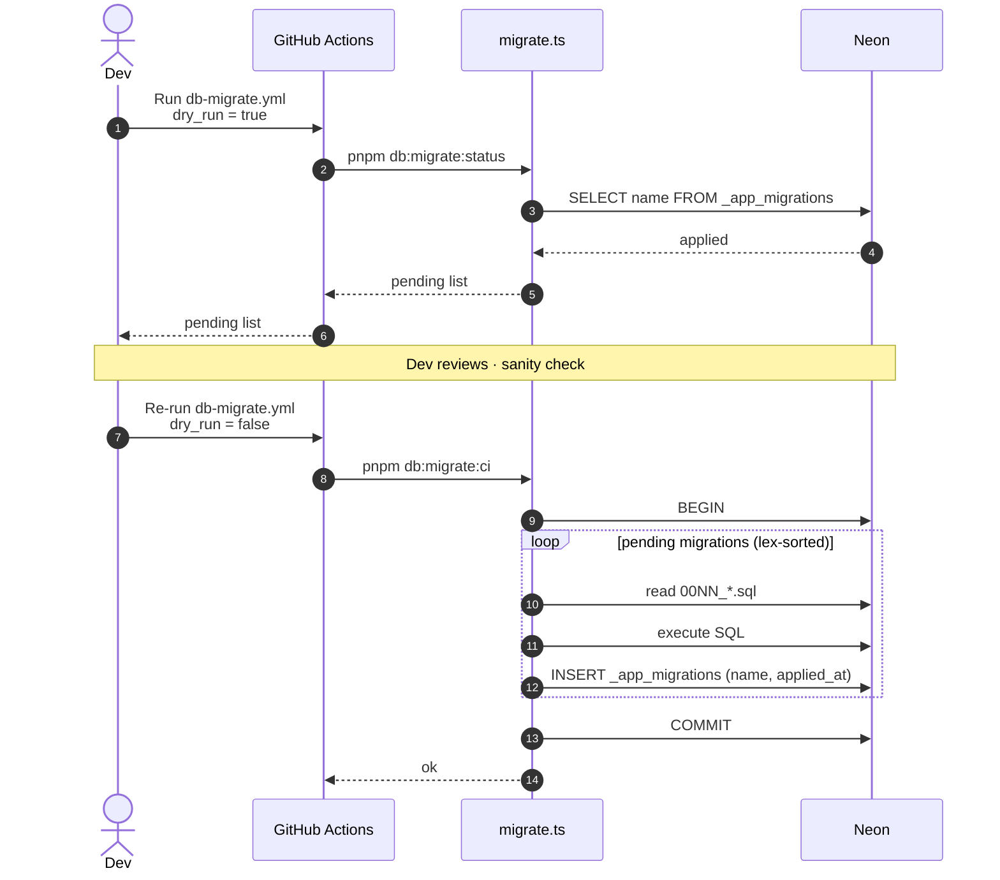
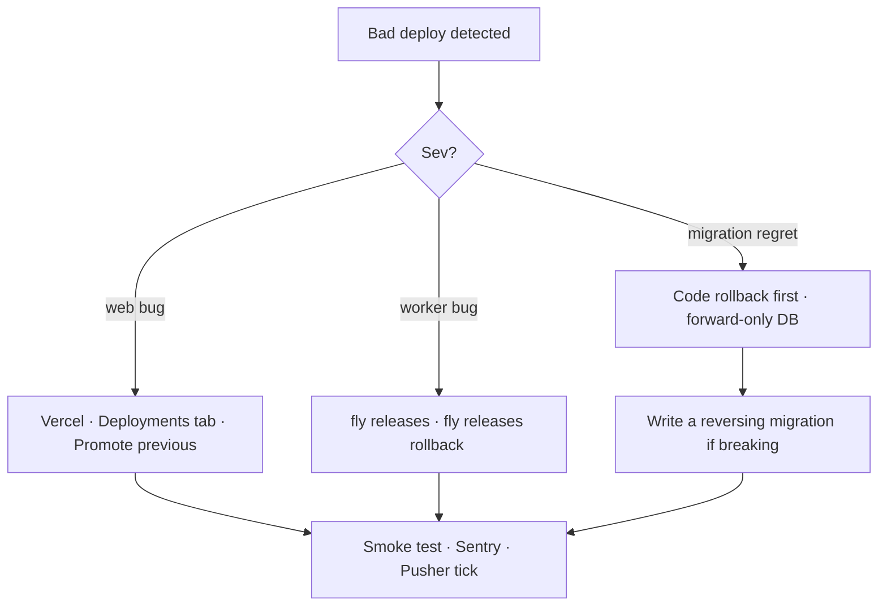
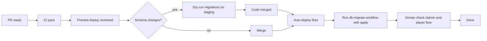

# Deploy Pipeline

How code moves from a local branch to production.

---

## End-to-end deploy

```mermaid
flowchart TD
    Dev[Developer · git push] --> PR[Open PR against main]
    PR --> CI[GitHub Actions · ci.yml<br/>typecheck · lint · test]
    PR --> VP[Vercel · preview deploy]
    CI -->|pass| Review[PR review]
    VP --> Review
    Review -->|merge| Main[main branch]
    Main --> DepWeb[deploy.yml · deploy-web]
    Main --> DepWorker[deploy.yml · deploy-worker]
    DepWeb --> VercelProd[Vercel production]
    DepWorker --> FlyProd[Fly.io rolling deploy]
    Main -.|if schema changes| Migrate[db-migrate.yml · manual, dry-run default]
    Migrate -->|approve + run| Neon[Neon production branch]
    VercelProd --> Live[Live on coinfrenzy.com]
    FlyProd --> Live2[Live worker on Fly]
```

---

## Migration workflow



---

## Rollback



---

## Secrets propagation

```mermaid
flowchart LR
    Doppler[Doppler dev/staging/prod] -->|Vercel integration| Vercel
    Doppler -->|"doppler run -- flyctl secrets import"| Fly
    Doppler -.|manual mirror, set per key| GH[GitHub Actions secrets]
    Vercel --> WebRuntime[apps/web runtime env]
    Fly --> WorkerRuntime[apps/worker runtime env]
    GH --> CI[CI/CD pipelines]
```

---

## Promotion checklist


