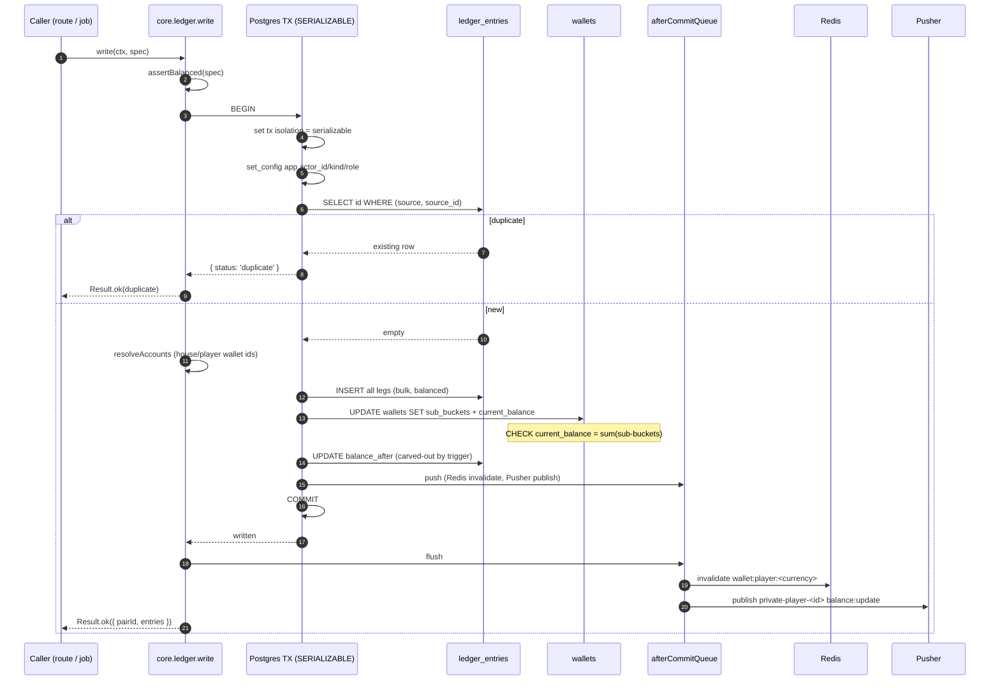
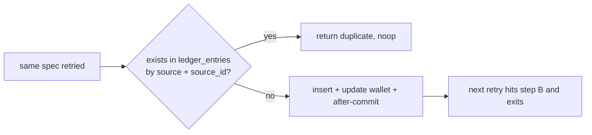
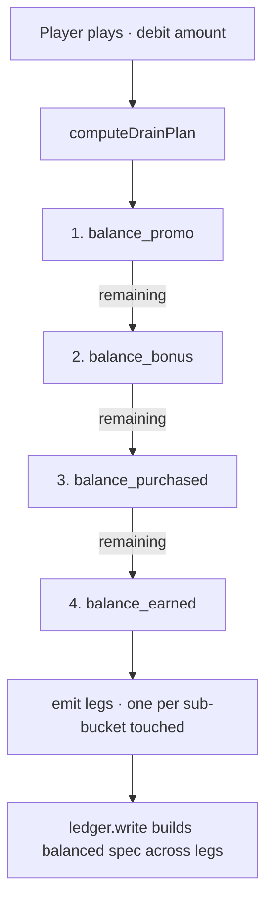
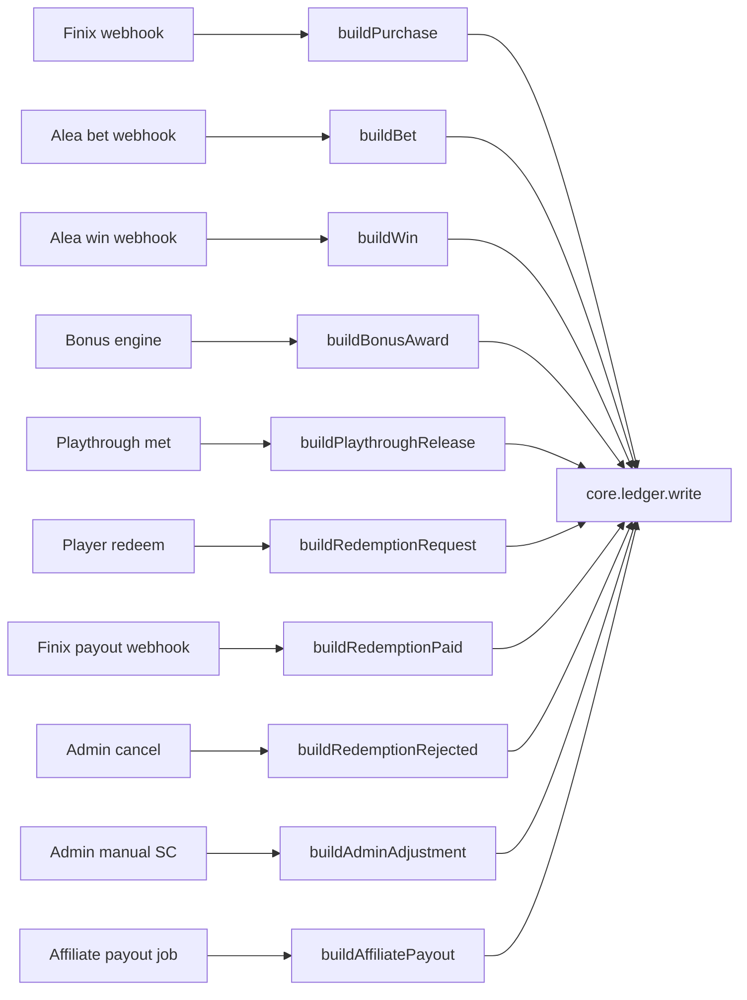

# Ledger Flow

The single write path every coin movement takes. See
`10-ledger-and-money.md` for the prose deep-dive.

---

## Write sequence



---

## Idempotency at a glance



---

## Drain order for play



---

## Wallet sum invariant

```mermaid
flowchart LR
    A[Any ledger_entries change] --> B[corresponding wallets UPDATE in same tx]
    B --> C{current_balance =<br/>purchased + bonus + promo + earned?}
    C -->|yes| D[commit]
    C -->|no| E[CHECK constraint rejects · tx rolls back]
    D --> F[reconciliation nightly: wallet.current_balance =<br/>SUM(ledger legs · player)?]
    F -->|drift| G[compliance_flags row + PagerDuty]
```

---

## Sources → builders


