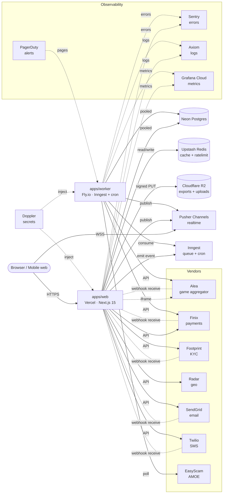
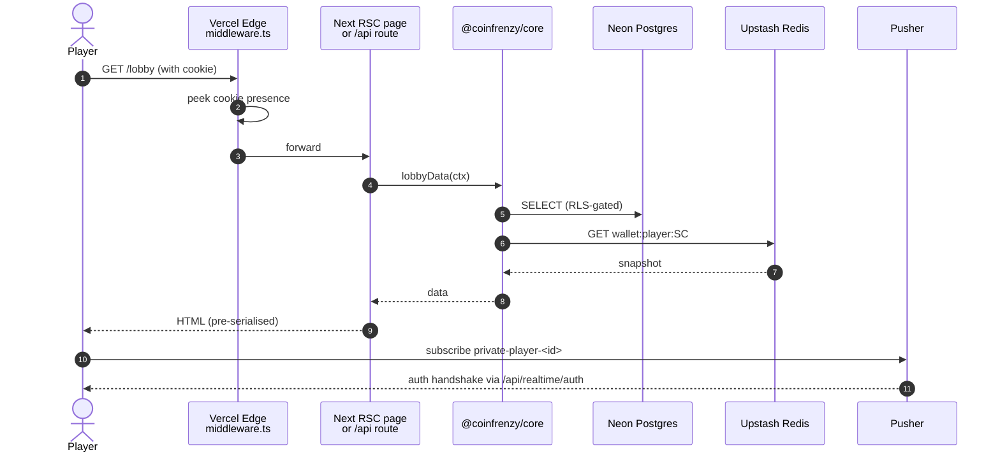
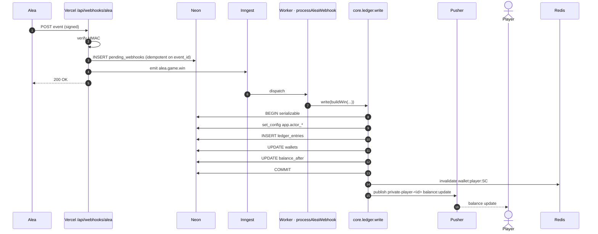

# System Overview

A bird's-eye map of every service, dependency, and data flow.

```mermaid
flowchart LR
    Browser([Browser / Mobile web])
    Vercel[apps/web<br/>Vercel · Next.js 15]
    Worker[apps/worker<br/>Fly.io · Inngest + cron]
    Neon[(Neon Postgres)]
    Redis[(Upstash Redis<br/>cache + ratelimit)]
    R2[(Cloudflare R2<br/>exports + uploads)]
    Pusher[Pusher Channels<br/>realtime]
    Inngest[Inngest<br/>queue + cron]

    subgraph Vendors
      Alea[Alea<br/>game aggregator]
      Finix[Finix<br/>payments]
      Footprint[Footprint<br/>KYC]
      Radar[Radar<br/>geo]
      SendGrid[SendGrid<br/>email]
      Twilio[Twilio<br/>SMS]
      EasyScam[EasyScam<br/>AMOE]
    end

    subgraph Observability
      Sentry[Sentry<br/>errors]
      Axiom[Axiom<br/>logs]
      Grafana[Grafana Cloud<br/>metrics]
      PagerDuty[PagerDuty<br/>alerts]
    end

    Doppler[Doppler<br/>secrets]

    Browser -- HTTPS --> Vercel
    Browser -- WSS --> Pusher

    Vercel -- pooled --> Neon
    Vercel -- read/write --> Redis
    Vercel -- publish --> Pusher
    Vercel -- emit event --> Inngest
    Vercel -- signed PUT --> R2
    Vercel -. iframe .-> Alea
    Vercel -- API --> Finix
    Vercel -. webhook receive .- Alea
    Vercel -. webhook receive .- Finix
    Vercel -. webhook receive .- Footprint
    Vercel -. webhook receive .- SendGrid
    Vercel -. webhook receive .- Twilio
    Vercel -- API --> Footprint
    Vercel -- API --> Radar
    Vercel -- API --> SendGrid
    Vercel -- API --> Twilio

    Worker -- consume --> Inngest
    Worker -- pooled --> Neon
    Worker -- publish --> Pusher
    Worker -- poll --> EasyScam
    Worker -- API --> Alea
    Worker -- API --> Finix

    Vercel -. errors .-> Sentry
    Worker -. errors .-> Sentry
    Vercel -. logs .-> Axiom
    Worker -. logs .-> Axiom
    Vercel -. metrics .-> Grafana
    Worker -. metrics .-> Grafana
    PagerDuty -. pages .-> Worker

    Doppler -. inject .-> Vercel
    Doppler -. inject .-> Worker
```

---

## Request lifecycle (typical)

```mermaid
sequenceDiagram
    autonumber
    actor Player
    participant Edge as Vercel Edge<br/>middleware.ts
    participant RSC as Next RSC page<br/>or /api route
    participant Core as @coinfrenzy/core
    participant DB as Neon Postgres
    participant Redis as Upstash Redis
    participant Pusher as Pusher

    Player->>Edge: GET /lobby (with cookie)
    Edge->>Edge: peek cookie presence
    Edge->>RSC: forward
    RSC->>Core: lobbyData(ctx)
    Core->>DB: SELECT (RLS-gated)
    Core->>Redis: GET wallet:player:SC
    Redis-->>Core: snapshot
    Core-->>RSC: data
    RSC-->>Player: HTML (pre-serialised)
    Player->>Pusher: subscribe private-player-<id>
    Pusher-->>Player: auth handshake via /api/realtime/auth
```

---

## Webhook → realtime tick

```mermaid
sequenceDiagram
    autonumber
    participant Alea
    participant API as Vercel /api/webhooks/alea
    participant DB as Neon
    participant Inngest
    participant Worker as Worker · processAleaWebhook
    participant Core as core.ledger.write
    participant Pusher
    actor Player

    Alea->>API: POST event (signed)
    API->>API: verify HMAC
    API->>DB: INSERT pending_webhooks (idempotent on event_id)
    API->>Inngest: emit alea.game.win
    API-->>Alea: 200 OK
    Inngest->>Worker: dispatch
    Worker->>Core: write(buildWin(...))
    Core->>DB: BEGIN serializable
    Core->>DB: set_config app.actor_*
    Core->>DB: INSERT ledger_entries
    Core->>DB: UPDATE wallets
    Core->>DB: UPDATE balance_after
    Core->>DB: COMMIT
    Core->>Redis: invalidate wallet:player:SC
    Core->>Pusher: publish private-player-<id> balance:update
    Pusher-->>Player: balance update
```
